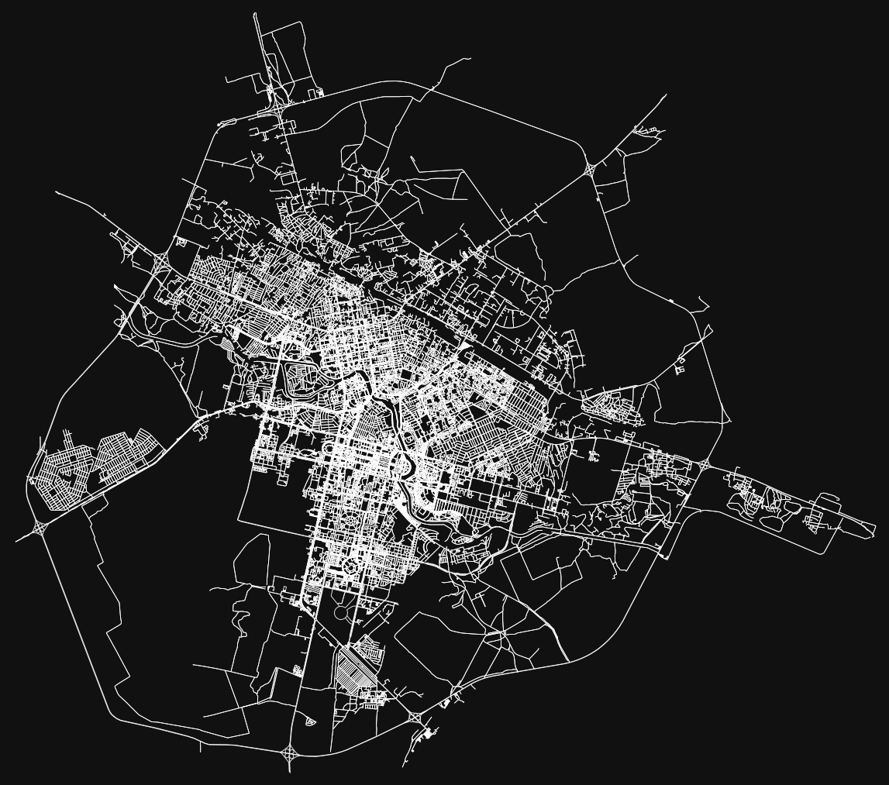

# Open Street Map Parse

## Usage
- `run script`

## API Docs
Осмнкс (OSMnx) - это библиотека Python, которая позволяет загружать, моделировать и анализировать географические данные, полученные из открытого проекта OpenStreetMap (OSM). При использовании OSMnx вы можете указывать различные атрибуты для получения определенных данных из OSM. Вот некоторые из основных атрибутов OSMnx:

1. `tags`: Позволяет фильтровать объекты по их тегам в OSM. Например, можно указать tags={'building': True} для получения только зданий или tags={'highway': True} для получения только дорог.

2. `network_type`: Определяет тип дорожной сети для извлечения. Некоторые доступные значения включают 'all' (все типы дорог), 'walk' (только пешеходные дорожки), 'bike' (только велосипедные дорожки), 'drive' (только дороги для автомобилей) и т.д.

3. `amenities`: Позволяет фильтровать объекты по типу предоставляемого сервиса или удобству. Например, можно указать amenities=['restaurant'] для получения только ресторанов или amenities=['school', 'park'] для получения школ и парков.

4. `custom_filter`: Позволяет указать пользовательский фильтр для объектов OSM с использованием запросов Overpass API. Например, custom_filter='["building"="church"]' позволяет получить только церкви.

5. `dist`: Определяет радиус вокруг указанной точки (центра), в котором будут извлекаться объекты. Например, dist=500 означает извлечение объектов в радиусе 500 метров от указанной точки.

Это лишь некоторые из возможных атрибутов, которые можно указать при использовании OSMnx. Более подробную информацию о доступных атрибутах и их использовании можно найти в документации OSMnx.

Граф, созданный с помощью OSMnx, содержит следующие атрибуты:

1. Узлы (Nodes):
   - `x`: Долгота узла.
   - `y`: Широта узла.
   - `osmid`: Идентификатор узла в OpenStreetMap.
   - Дополнительные пользовательские атрибуты, такие как name, amenity, highway и т.д., которые зависят от доступных данных в OSM.

2. Ребра (Edges):
   - `osmid`: Идентификатор ребра в OpenStreetMap.
   - `name`: Имя дороги (если доступно).
   - `highway`: Тип дороги (например, residential, primary, motorway и т.д.).
   - `oneway`: Флаг одностороннего движения (True/False).
   - `length`: Длина ребра в метрах.
   - `geometry`: Геометрия ребра в формате LineString.

Это основные атрибуты, которые можно получить из графа, созданного с помощью OSMnx. Кроме того, вы также можете добавлять пользовательские атрибуты к узлам и ребрам при создании графа.

### Работа с дорожным графом:
Тег `highway` - основной и часто единственный для обозначения дорог и улиц. Ряд значений, которые он может принимать:
- `primary` - Автомобильные дороги регионального значения
- `secondary` - Автомобильные дороги областного значения
- `tertiary` - Более важные автомобильные дороги среди дорог местного значения
- `living_street` - Улицы, на которых пешеходы имеют преимущество перед автомобилями
- `pedestrian` - Для обозначения улиц городов, выделенных для пешеходов.
- `track` - Дороги сельскохозяйственного назначения.
- `path` - Тропа без назначения. Беговая лыжня, велосипедный маршрут, пешеходный маршрут.
- `footway` - Пешеходные дорожки. Если по ним разрешено передвижение на велосипеде, то необходимо добавить тег `bicycle=yes`.
- `cycleway` - Велодорожка. Если это дорожка и для пешеходов, можно добавить тег foot=yes.

### Работа с объектами (здания, парки, учреждения):
`osmnx.geometries.geometries_from_address(address, tags, dist=1000))`

Create GeoDataFrame of OSM entities within some distance N, S, E, W of address.

PARAMETERS:
- `address` (string) – the address to geocode and use as the central point around which to get the geometries
- `tags` (dict) – Dict of tags used for finding objects in the selected area. Results returned are the union, not intersection of each individual tag. Each result matches at least one given tag. The dict keys should be OSM tags, (e.g., building, landuse, highway, etc) and the dict values should be either True to retrieve all items with the given tag, or a string to get a single tag-value combination, or a list of strings to get multiple values for the given tag. For example, tags = {‘building’: True} would return all building footprints in the area. tags = {‘amenity’:True, ‘landuse’:[‘retail’,’commercial’], ‘highway’:’bus_stop’} would return all amenities, landuse=retail, landuse=commercial, and highway=bus_stop.
- `dist` (numeric) – distance in meters

RETURNS: `gdf`

RETURN TYPE: `geopandas.GeoDataFrame`

